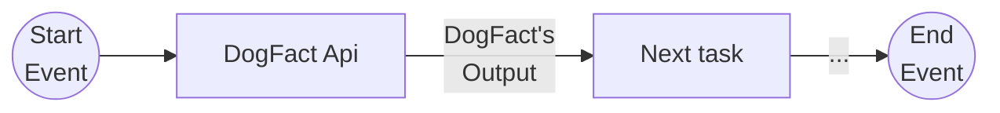
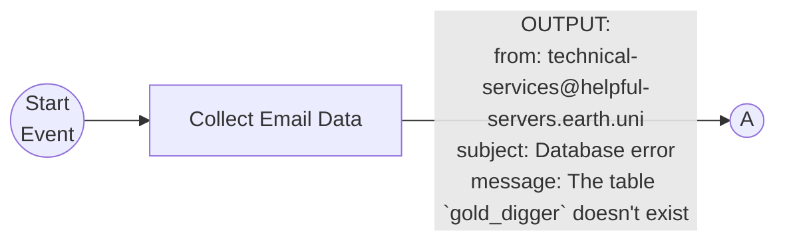
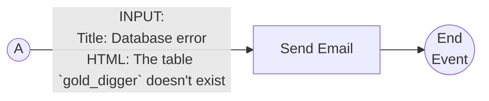
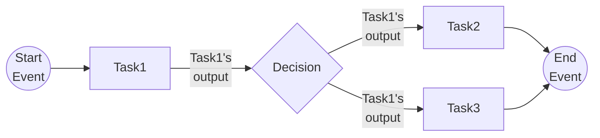
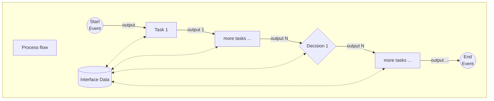
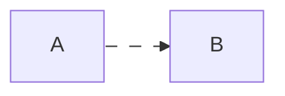

# Data Management
[^DogFactOutput]: output of DogFact.
[^InsertLink]: Insert a link covering the `code` area, remove the code markers (\`) and the text '(NOTE: INSERT LINK)'
[^TBD]: Feature to be done. Once completed remove the code markers (\`) and the text '(TBD)'

## Abstract
Any flow in any system generates or processes data in its lifecycle. The simple act of, for example, filling in a satisfaction form from multiple participants and producing a statistic from it, is a very real case of data creation, processing and output. In yesteryears this would be done in paper and someone would have to count the answers, maybe categorizing them by gender or age for further target assessment, which in turn would produce more information and refine the resulting output.

But whereas in our example, paper was the medium where the data was recorded, where does the data reside in the engine?

It resides in either or both of:
- The task output
- The interface data.

## Task Output
By norm, all tasks are to generate output in the form of a JSON-like object. 

**Example**
In this example, we have a page for dog lovers. In that page we have a strip with a fact related to dogs. This strip is being updated by through a workflow, specifically by a task called `DogFact`.

`DogFact` is an `API task(TBD)`[^TBD] with the endpoint `https://dogapi.dog/api/v2/facts?limit=1` and we get for example the response[^DogFactOutput]:

```json
{
  "data": [
    {
      "id": "ed181eb0-fecb-4c9a-92c5-c556aa55fe41",
      "type": "fact",
      "attributes": {
        "body": "Dogs can discriminate the emotional expressions of human faces."
      }
    }
  ]
}
```

|Task|Output|
|--|--|
|DogFact|[^DogFactOutput]`{"data":[{"id":<uuid>,"type":string,"attributes": object}]}`|

Accordingly, any task has direct access to its previous task's output. 


### Access to previous task's output

All tasks have direct access to the previous tasks' output.

The way that access is granted may differ slightly by task type

#### Access by task type

The following table shows how data is accessed by the current task

|Previous task's output|Task type|Access|
|-|-|-|
|\<output\>|Script|\<output\> and the flow information is sent as a payload to the task, with the following structure:<p>pfData :=<ul><li>header:<ul><li>workflowId: _UUID_</li><li>executionId: _UUID_</li><li>activityExecutionId: _string_</li></ul></li><li>data:\<output\></li></ul>|
|\<output\>|API||
|\<output\>|AI&nbsp;Agent||
|\<output\>|All| For all tasks that have properties (e.g.: `title`), it is possible to bind to the whole property, or part of it, to data in \<output\>.<p>There are two ways to achieve this result:<ul><li>By text -- directly write the binding as text inside an input for the property, for example:<ul><li>'_{/data/from/ouput}_'<li>'_The name of my pet is {/pet/name}_'</ul></li><li>By UI -- use the value help to write a text with assisted selection of the binding you want</li></ul>|

*Example*
As an example lets assume that we have an smtp task that sends log emails to the same address.
The following properties are being used: 'To', 'Title' and 'Html'.

From a previous script task we receive the following data:
```json
{
	"from": "technical-services@helpful-servers.earth.uni",
	"subject": "Database error",
	"message": "The table `gold_digger` doesn't exist"
}
```

So, if the smtp task wants to send this information to the email `logs@log-servers.earth.uni`, its properties must have the following values:
|Field|Binding|Final result|Comment|
|-|-|-|-|
|**To**|`logs@<br>log-servers.earth.uni`|`logs@log-servers.earth.uni`| this is static text, without any binding|
|**From**|`{/from}`|_technical-services@helpful-servers.earth.uni_'||
|**Title**|`{/subject}`|_Database error_||
|**HTML**|`{/message}`|_The table `gold_digger` doesn't exist_||





### Task output in Decision nodes

Decision nodes are an exception and they don't generate output, so their succeeding task acquire data from their preceeding task



### Start Event's output

The Start Event does not have an output `per se`, instead, when starting a process flow, it is possible to add a payload to the run api, and some of it will work as the Start Event's output.

The data that will serve as the output of the Start Event must be assigned to the `directOutput` property of the payload.

```json
payload := {
	directOutput: <data to serve as the Start Event ouput>,
}
```

### Limitations of the task output

The task ouput has a limitation in its scope. Its data is local to the workflow engine and accessible only to the next task.

The interface data is designed to overcome this limitation.

## Interface Data

*Interface Data* is a global data repository, that exists **only during a workflow execution**. Each workflow execution has its own dedicated *Interface Data* instance. This data can be accessed from anywhere in the workflow, or from inside of a task.

The definition for the *Interface Data* is called *`Interface Definition(NOTE: INSERT LINK)`*[^InsertLink] and can be defined here in the `Process Flow tool(NOTE: INSERT LINK)`[^InsertLink]. The *Interface Definition* is a contract of what the *Interface Data* should contain. *Interface Definitions* are unique to a single *`Process Flow Definition(NOTE: INSERT LINK)`*[^InsertLink].

### Data read access

Data read access during design time, on the *Process Flow*, can be done in two ways:

 - Text binding
 - `UI assistance(TBD)`[^TBD]

For *Interface Data* read handling in runtime inside of tasks, please refer to the `developer documentation(NOTE: INSERT LINK)`[^InsertLink].

#### Text binding

If the user so wishes, the user can directly write a text [binding](https://sapui5.hana.ondemand.com/sdk/#/topic/91f0652b6f4d1014b6dd926db0e91070) or [expression binding](https://sapui5.hana.ondemand.com/sdk/#/topic/daf6852a04b44d118963968a1239d2c0) (SAPUI5 format) to access the *Interface Data* contents. It must use the model **InterfaceData** in the binding, for example: {**InterfaceData>**/property}.

**Example**:
If the following data exists in the Interface Data:
```json
{
	contacts: [
		{ firstname: 'Inacius', lastname: 'Poncius' },
		{ firstname: 'Glaudius', lastname: 'Aurelius' }
	]
}
```

All of the following bindings or expressions are valid accesses to the *Interface Data*:

|Binding/Expression|Result|
|:-|:-|
|{InterfaceData>/contacts/0/firstname}|Inacius|
|Hi, my family name is {InterfaceData>/contacts/1/lastname}!|Hi, my family name is Aurelius!|
|{= ${InterfaceData>/contacts/length} === 2}|true
|{= ${InterfaceData>/contacts/length} === 0 ? 'No contacts found' : 'At least one contact found'}|At least one contact found|

The following are not:

|Binding/Expression|Reason|
|:-|:-|
|{/contacts/length}|It accesses the previous task's output, not the Interface Data|
|{InterfaceData/contacts/length}|It misses the '**>**' sign that separates the model from the path|
|{InterfaceData>contacts/length}|It misses the initial '**/**' sign which is the start of the data|
|{=&nbsp;${Interface&nbsp;Data>/contacts/length}&nbsp;===&nbsp;2}|It has a space between Interface and Data. It must be written all together like this: **InterfaceData**|

### Data write access

Data write access during design time, can be accomplished throught the `Set Interface Data task(TBD)`[^TBD].

For *Interface Data* write handling in runtime inside of tasks, please refer to the `developer documentation(NOTE: INSERT LINK)`[^InsertLink].

The *Set Interface Data* task, receives input from the previous task's output and writes into the selected fields of the *Interface Data* through binding. See more in the documentation for the `Set Interface Data task()(NOTE: INSERT LINK)`[^InsertLink].

## Data access visual representation

This diagram depicts the role and importance of both the *Task Output* and the *Interface Data*.




